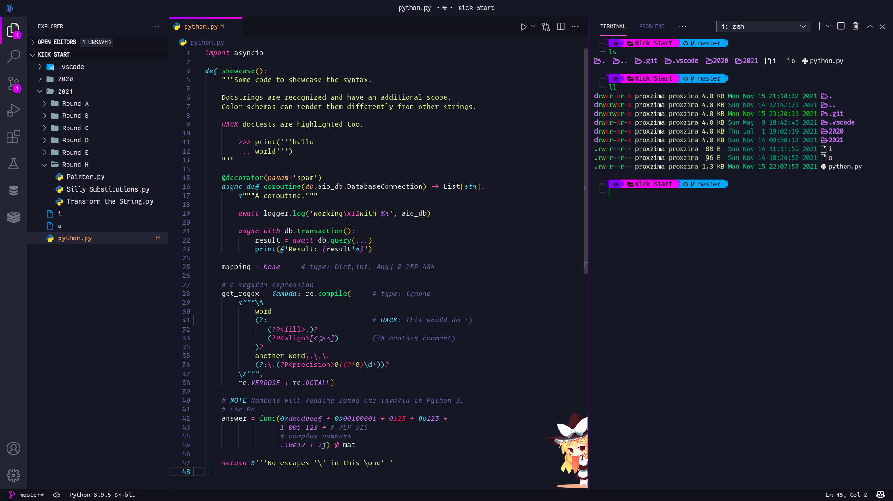
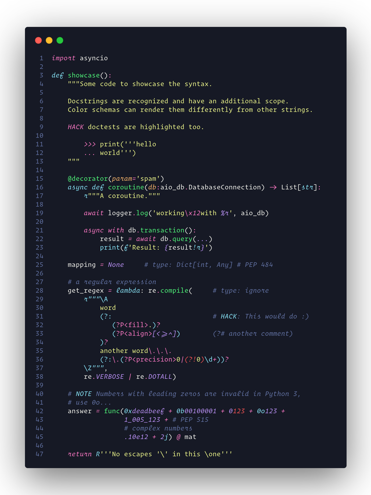

# Sweet Dracula V2

[](https://marketplace.visualstudio.com/items?itemName=felcadev.sweetdraculav2)
[](https://marketplace.visualstudio.com/items?itemName=felcadev.sweetdraculav2)
[](https://marketplace.visualstudio.com/items?itemName=felcadev.sweetdraculav2)

**Sweet Dracula V2** — A beautiful, darker - [Dracula](https://github.com/dracula/visual-studio-code) fork for [VSCode](https://marketplace.visualstudio.com/items?itemName=felcadev.sweetdraculav2) and [Code - OSS](https://open-vsx.org/extension/felcadev/sweetdraculav2).

<h3 align="center"><b>VS Code</b></h3>



<h3 align="center"><b>Syntax Highlighting</b></h3>



---

## Install

1. Go to `View -> Command Palette` or press `⌘+shift+P`
2. Then enter `Install Extension`
3. Write `sweetdraculav2`
4. Select it or press Enter to install

---

## Development

This extension is structured as a multi-theme package. Theme files in `themes/`
are generated from shared mappings and palettes.

```sh
npm install
npm run build:themes
npm run validate
```

Available themes:

- `Sweet Dracula V2`
- `Sweet Dracula V2 Blue`
- `Sweet Dracula V2 Soft`

Do not edit files in `themes/` directly. Edit palette files in `src/palettes/`
and then run `npm run build:themes`.

To add another theme:

1. Copy one palette from `src/palettes/`.
2. Change `name`, `filename`, and color values.
3. Import it in `scripts/build-themes.mjs`.
4. Add it to `contributes.themes` in `package.json`.
5. Run `npm run validate`.

To test locally, open this folder in VS Code, press `F5`, and select a
`Sweet Dracula V2` theme from `Preferences: Color Theme`.

---

## VSCode UI

Above screenshot contains modified VSCode UI.

---

## Recommended settings

- `"editor.renderLineHighlight": "gutter"`
- `"editor.occurrencesHighlight": false`
- `"editor.selectionHighlight": false`

---

## Contributing

If you'd like to contribute to this theme, please read the [contributing guidelines](.github/CONTRIBUTING.md).

---

## License

[MIT License](LICENSE)

---

### [Release Notes](CHANGELOG.md)
